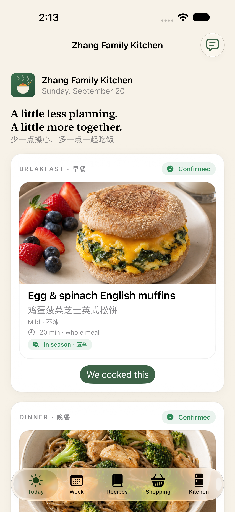
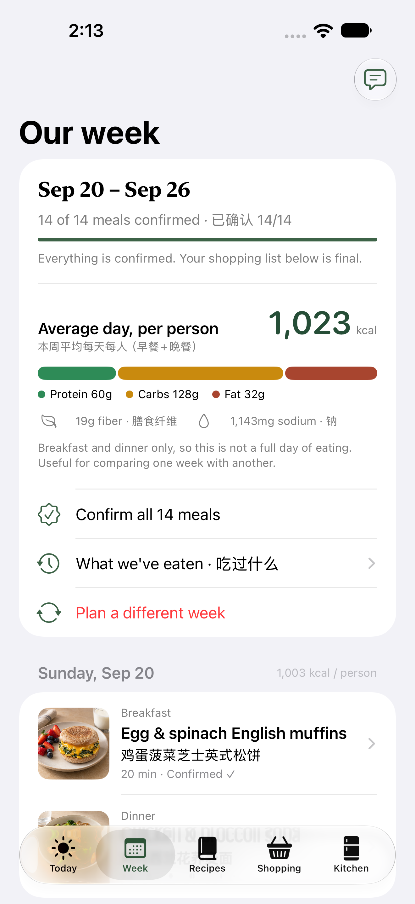
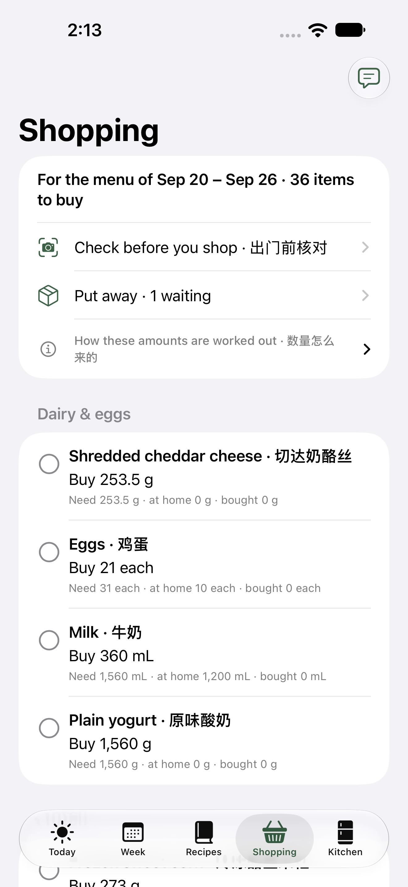
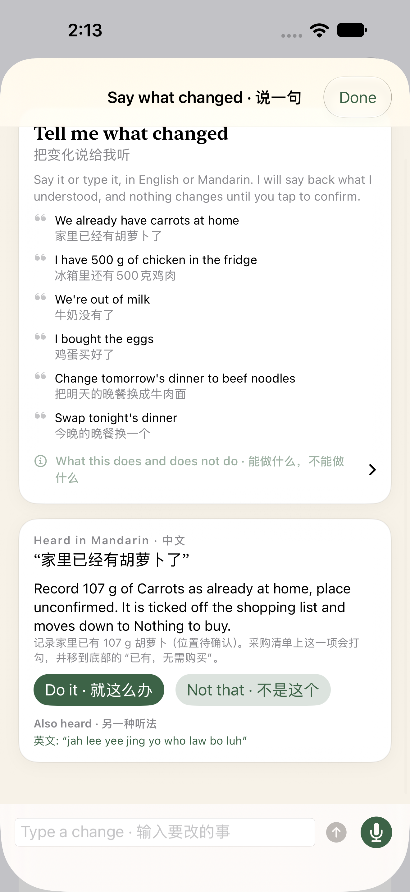

# Family Kitchen · 家庭厨房

**Version 0.4 · by Frank Zhang**

An iPhone app that turns "what's for dinner?" into a question the whole family answers once a week — and then does the shopping list, the fridge map and the recipe for you.

一款 iPhone 应用：一周只操心一次"今天吃什么"，剩下的采购清单、冰箱位置和菜谱，交给它。

---

# English

## What this app is for

Cooking for a family of five is rarely about cooking. It's the deciding, the forgetting, the second trip to the store, and the ten minutes spent looking for the ginger. Family Kitchen exists to take those parts away.

Once a week you sit down together for a few minutes. The app proposes seven days of breakfasts and dinners. The children swap what they don't want. You confirm. From that one decision the app produces the grocery list, tells everyone where to put the food when it comes home, and each evening shows the recipe in Chinese with the exact shelf each ingredient is sitting on.

It grew out of one particular family — five people, mild Chinese and simple Western food, dinner on the table in about half an hour, noodles and rice taking turns, children who should have a say in what they eat — but the household, the allergies and the portions are all yours to set.

## What it looks like

<p align="center">
  
  
  
  
</p>

<p align="center"><em>Today · Week · Shopping · Say what changed</em></p>

The fourth one is the part this README spends the most words on, so it is worth reading closely: a sentence was said in Mandarin, the English recogniser produced confident nonsense (shown underneath as *Also heard*), and the app believed the ear that understood the kitchen. What it understood is written out in both languages with **Do it** and **Not that** underneath, and the shopping list has not changed yet.

All seven pictures are regenerated from the running app by `python3 scripts/screenshots.py` — never touched up, and never drawn by hand. They come from an iPhone 18 Pro Max simulator at 1320 × 2868, which is the size the App Store asks for. See [Screenshots/README.md](Screenshots/README.md) for what each one shows and how the voice one was produced.

## A week in five steps

The Today screen shows these five steps and where you are in them, so nobody has to remember the order.

**1. Plan the week · 排菜单**
Open **Week**, pick the starting day, tap *Plan this week's menu*. You get seven days of breakfast and dinner. The suggestions avoid spice, alternate rice and noodles, vary the protein, keep dinners around thirty minutes, never repeat a dinner within the week, and favour food you already have.

**2. Everyone chooses · 一起点餐**
Tap any meal. Each child votes, sees the picture, and can swap the dish — the six closest alternatives come first, the full catalogue is one tap further. A parent confirms each meal, or confirms all fourteen at once. Disagreement is settled by the parent, on purpose.

**3. Shop once · 一次买齐**
The **Shopping** list is built from the confirmed menu: every ingredient scaled to your family, added up across the week, minus whatever you have already confirmed in your kitchen. Names are in English and Chinese, grouped by aisle-like categories. Tick items off as you go.

**4. Put it away · 收纳归位**
After shopping, **Put away** suggests a shelf for each item based on how it needs to be stored and how your kitchen is actually laid out. Whoever puts it away confirms where it really went and how much was really bought — children can do this part. Only then does it count as food you have at home.

**5. Cook tonight · 照着做饭**
**Today** shows the day's breakfast and dinner, the recipe steps in whichever language you chose, the amounts for your family, and — the part that saves the most time — where each ingredient is right now. After dinner, one tap records the meal as cooked.

**And at any point · say it**
The speech bubble at the top of Today, Week and Shopping takes a sentence in English or Mandarin — *"we already have carrots"*, *"change tomorrow's dinner to beef noodles"* — and turns it into a change you confirm with one tap. See [Say what changed](#say-what-changed).

**And in between · Kitchen**
The **Kitchen** tab is what you have at home, grouped by the appliance it actually sits in and the shelf inside it — one section per fridge, freezer or pantry, with anything unplaced at the end. It also holds the photos you take of a shelf, and the ⚙︎ **Settings** for everything below.

## Make it your kitchen

Name your kitchen in **Kitchen → ⚙︎ Settings** — *Zhang Kitchen*, *The Lee Family Table*, whatever you call it at home — and that name appears at the top of Today and on the week. The app is called Family Kitchen; the kitchen is yours.

Settings is a short menu rather than one long form: **Family & portions**, **Allergies**, **Where food lives**, **Language & appearance**, and **About**. Each row shows what it is currently set to.

**Day and night.** By default the app matches your iPhone, so if iOS is set to Automatic it turns dark at sunset along with everything else. If your phone stays in Light mode, choose **By time** and pick the hours — 7pm to 7am by default — and the app switches itself. It changes on its own as the hour passes and whenever you reopen it, with no location needed: the app has no idea where you are, so it works off the clock rather than your real sunset. *Day* and *Night* pin it either way.

## Who's at the table

Add the people who live here under **Settings → Family & portions**. Mark each one adult or child, and give each child their age. Children get a vote on every meal, and their names appear on the meal screen.

**Portions follow who is actually eating.** Recipes are written for five adult portions, and each person is counted from there: an adult is one portion, a child is about a quarter under 2, 0.4 at 2–3, 0.65 at 4–8, 0.85 at 9–13, and a full portion from 14. Add guests for the week, or set any one person's amount by hand — a teenager who eats like two adults, an adult with a small appetite.

The shopping list follows that number directly, so two adults and three small children stop buying for five grown-ups.

## Where food lives

Add the fridges, freezers and pantries you actually own — up to four of each — and say **which room each one is in**. That part matters most: a house with a fridge in the kitchen and another in the garage needs to tell them apart before anything else, and "Garage fridge" is how a family really talks about it. The Kitchen tab, the put-away step and "where is the ginger?" all name the appliance and the room.

A new fridge arrives laid out like an ordinary one — **freezer on top, three shelves, a fruit & veg drawer, a dairy drawer, and the door** — and every one of those can be renamed, deleted, moved between fridge and freezer temperatures, or added to. Each shelf carries its own temperature, which is why a fridge can hold a frozen compartment and why the app never suggests putting ice cream in the door.

**As much or as little detail as you want.** When you add an appliance, choose *Shelf by shelf* for the full layout or *Keep it simple* for one place — and even then a fridge keeps its freezer separate, because which of the two something is in decides how long it keeps. You can start simple and add drawers later, or start detailed and delete what you do not have.

Removing an appliance or a shelf never deletes the food in it: whatever was stored there simply goes back to having no confirmed place.

## Check the shelf before you shop

The shopping list already subtracts what you have confirmed at home. The problem is the half-bag of carrots nobody got round to recording.

So before you set off, open **Shopping → Check before you shop**, pick the shelf you are standing in front of, and take a few photos. The app reads them **on this iPhone** — nothing is uploaded, and the photos taken here are not kept once they have been read — and comes back with what it saw, each item labelled with the words the recogniser used and how sure it was. Tick what is right, correct any amount, and confirm. Everything you confirmed is recorded on that shelf, drops off the list, and moves to a **Nothing to buy** section at the bottom, so what is left at the top is only what you still need to put in the trolley.

Two things it does deliberately:

- **It asks a narrow question.** Not "what is in this fridge" but "of the things on my list, which are already at home" — a much smaller question, and the reason a general-purpose recogniser is useful here at all. Anything it spots that is not on the list is offered separately, unticked.
- **It never ticks anything off by itself.** A recogniser that mistakes a lemon for an orange must not be able to send you home without the eggs, so a person confirms every item before the list changes. A photo also cannot say *how much* there is: the amount offered is exactly what this week's menu is short of, and it is yours to correct.

Recognition is general — good at whole foods, vague about boxes and jars, and no help at all with an unopened carton. Whatever it misses, you add by hand exactly as before.

## Say what changed

The week is full of small corrections. There is already ginger in the door. Nobody wants fish on Thursday. The eggs are in the trolley. Each of these is a screen, a scroll and a tap, and the person holding the bag has one hand free.

So tap the speech bubble at the top of **Today**, **Week** or **Shopping**, and say it — or type it. In English or in Mandarin; you do not choose, and you can change language mid-week without telling the app.

> "We already have carrots at home" · "家里已经有胡萝卜了"
> "I have 500 g of chicken in the fridge" · "冰箱里还有500克鸡肉"
> "We're out of milk" · "牛奶没有了"
> "I bought the eggs" · "鸡蛋买好了"
> "Change tomorrow's dinner to beef noodles" · "把明天的晚餐换成牛肉面"
> "Swap tonight's dinner" · "今晚的晚餐换一个"

It understands four things, which are the four things a week is actually made of: **what you already have**, **what you have run out of**, **what you have bought**, and **which dish goes on which day**. Saying you already have something records it at home, and the shopping line is ticked off and drops to **Nothing to buy** at the bottom — the same place the photo check sends it, because it is the same change.

**It listens in both languages at once.** One microphone feeds an English recogniser and a Mandarin one, and the reading this kitchen can actually act on is the one that is used. The other reading is shown underneath, so a sentence heard by the wrong ear costs one tap rather than a repeat.

**It runs on this iPhone.** Only recognisers that work offline are used. If your phone has not got one of the two languages yet, the app says so and points at Settings → General → Keyboard → Dictation Languages rather than quietly sending your kitchen talk to a server. Nothing is uploaded, and no recording is kept.

Three things it does deliberately:

- **It says back what it understood, in both languages, and waits.** "Melons" for "lemons" must not be able to change tonight's dinner, so every sentence becomes a written sentence you read before tapping *Do it*. The most recent change can be taken back on the spot.
- **It asks rather than guesses.** "换成咖喱" fits two curries, and "beef noodles" fits three noodle dishes, so it offers them instead of choosing. A dish it has never heard of is admitted, not approximated.
- **It never invents a number or a shelf.** With no amount said, it records exactly what the week is short of — the same figure the photo check offers. Food recorded this way has no shelf yet; confirm where it went in **Kitchen** or **Put away**, as with anything else.

What it will not do: it cannot plan a week, confirm a meal for a parent, add a dish, or name a shelf. Those are still screens, on purpose.

## Dishes of your own

Tap **+** on the Recipes screen to add a dish, either by typing it in or by pasting a link.

Pasting a link is **the only time this app uses the internet**. It opens the page you gave it and reads the recipe data most recipe sites publish. What comes back is a draft: the name, the steps, the time and the ingredient lines. Ingredients the app recognises are matched for you; the rest stay as notes, shown with the recipe but deliberately left out of the shopping list and the nutrition estimate, which says so rather than undercounting.

While you are typing, **Done · 完成** sits above the keyboard. The amounts use a number pad, which has no return key of its own, so without it there was no way to put the keyboard down and reach *Save*.

Tell it how many adult portions those amounts serve and everything is rescaled to your family. Saved dishes then behave like any other: planned into weeks, added to the shopping list, counted in nutrition, and editable or deletable at any time.

Imported text stays on your iPhone for your own kitchen. The wording of someone else's recipe belongs to them — the link is kept with the dish, and it is not for republishing.

## Allergies and foods to avoid

The same screen carries the major allergens: milk, egg, fish, shellfish, peanut, tree nuts, wheat/gluten, soy and sesame. Exclude one and it is **never recommended and never offered as a swap**. If you deliberately choose a dish that contains it, the app still lets you — and flags it clearly, on the card, in the meal review and in the recipe.

This matches ingredients, not the label in your hand. Two that surprise people: ordinary soy sauce is brewed with wheat, and most dried soba is cut with wheat flour — both are marked. Cross-contact from shared equipment is invisible to any app, so a family managing a real allergy still reads every package.

## Cooking with the seasons

Menus follow the calendar. Produce at its US seasonal peak — cheaper, better tasting, less often shipped across a hemisphere — is favoured when the week is planned, so July leans on tomatoes, zucchini, cucumbers and peaches, while January leans on cabbage, broccoli, bok choy and oranges.

Each recipe shows what is at its peak this month and what is out of season, the recipe list has an **in season this month** filter, and the browse screen names the produce that is good right now. Out-of-season food is never blocked — it is simply not pushed at you.

## What we've eaten

Every meal you mark as cooked is recorded, and whenever a planned week is replaced the old week is archived too. Open **Week → What we've eaten** to see it by week, along with the dishes that have come round most often in the last 90 days.

The record distinguishes **cooked** (someone confirmed it that day) from **planned** (it was on the menu and the week moved on). The app does not claim to know whether the second kind was eaten.

Next week's menu uses this memory: anything eaten in the last fortnight is pushed well down the list, and a dish that keeps reappearing within three months is nudged down too. About two years of meals are kept, on this iPhone only.

## Nutrition

Every recipe and every planned day shows an estimate, per person: calories, a labelled bar for protein / carbohydrate / fat, plus fibre and sodium.

- Figures come from reference values for ingredients **as bought** — raw meat, dry pasta, drained cans.
- They are not measurements of the finished dish, and cooking losses, leftovers and who eats how much are not modelled.
- Only breakfast and dinner are planned here, so a day total is **never** a claim about a whole day's needs. Lunch and snacks are outside the app.
- It is a way to compare one meal or one week against another. It is not medical or age-specific advice.

## What it deliberately does not do

Being honest about this is part of the design.

- **Photo recognition proposes; it never decides.** The shop check reads photos on this iPhone and suggests what it saw, but nothing reaches the shopping list or your stock until you confirm it. A photo never decides freshness, and never decides quantity — the amount offered is what the menu needs, not what the picture shows.
- **Speech proposes; it never decides either.** What you say is written back out and waits for a tap, for the same reason a photo does.
- **Nothing is assumed into your pantry.** Only amounts someone confirmed are subtracted from the shopping list.
- **Planning a meal does not consume ingredients.** Stock changes when you shop, put away, or finish cooking.
- **Suggested shelves are suggestions**, shown separately from the place you actually confirmed.
- **Everything stays on this iPhone.** No account, no cloud sync, no uploads, no analytics. Photos and speech are both read on the device, and a recogniser that would need a server is not used at all. The single exception is importing a dish from a link, which opens the page you paste — and only then. Parent and child roles are a family agreement on a shared device, not passwords.
- **Recipe pictures are AI-generated illustrations** made for this app — not photographs of tested cooking.
- **Times and nutrition are estimates**, not kitchen-tested or laboratory-measured.
- **Allergen filtering is ingredient-level**, not label-level, and cross-contact is not modelled.
- **Seasonal data is a national US generalisation.** Your local market is the better authority.

## Running it on your iPhone

1. Install the full Xcode (16 or newer) on a Mac.
2. Open `FamilyKitchen.xcodeproj` and choose the **FamilyKitchen** scheme.
3. To use a simulator, pick one and press **⌘R**. No account or API key is ever required.
4. To use a real iPhone: connect it, enable Developer Mode, then under **Signing & Capabilities** choose your own Apple team and, if needed, a unique bundle identifier. Then run.
5. The camera needs a real iPhone; the simulator can still import from Photos. Photo access uses the system picker, so only the pictures you choose ever reach the app.

## For developers

```sh
# Build
DEVELOPER_DIR=/Applications/Xcode.app/Contents/Developer xcodebuild \
  -project FamilyKitchen.xcodeproj -scheme FamilyKitchen -sdk iphonesimulator \
  -destination 'generic/platform=iOS Simulator' CODE_SIGNING_ALLOWED=NO build

# Core logic checks (no XCTest runtime needed)
python3 scripts/check_core.py

# Regenerate the app icon
swift scripts/make_icon.swift FamilyKitchen/Assets.xcassets/AppIcon.appiconset/icon-1024.png 1024
```

- `FamilyKitchen/` — SwiftUI screens, the `Brand` design system, and recipe images.
- `Sources/FamilyCore/` — recipes, ingredients, nutrition tables and all planning logic, free of UI.
- `Tests/` — core scenarios and UI tests. `scripts/check_core.py` runs the core scenarios without XCTest, which this machine's default toolchain cannot import; it compiles every file in `Sources/FamilyCore` automatically.
- The icon is drawn in Core Graphics by `scripts/make_icon.swift`, and `BrandMark` in `FamilyKitchen/Brand.swift` redraws the same 1024-unit coordinates in SwiftUI, so the home-screen icon and the in-app mark stay identical.
- Note that `swiftc -parse` only checks syntax, never call signatures. Use the `xcodebuild` command above after touching SwiftUI.
- Saved files are versioned and migrated on load (`FamilyState.currentVersion`, `migrate()`): older files open and are upgraded, and a file written by a *newer* app is refused rather than overwritten. Add fields freely; add a conversion to `migrate()` whenever the shape of existing data changes.
- Spoken and typed commands are parsed in `Sources/FamilyCore/KitchenCommands.swift` — a table of the words families use in both languages, no model and no network, so the whole of it is covered by the core checks. `FamilyKitchen/VoiceInput.swift` is the only part that needs a microphone: two `SFSpeechRecognizer`s, both `requiresOnDeviceRecognition`, fed from one `AVAudioEngine` tap. `FamilyKitchen/KitchenChatView.swift` is the sheet.
- Current scope: one active week at a time, on one device. No cloud sync, list export, store grouping, barcode scanning, custom recipes or custom ingredients. Spoken and typed commands cover stock, purchases and meal swaps only — not planning, approving, adding dishes or naming shelves. 56 dinners, 20 breakfasts, 79 bilingual ingredients with nutrition, allergen and seasonality tables.
- Still on the list before selling: real food photography, cooking every recipe to verify the times, CloudKit family sharing, and App Store paperwork (privacy labels, policy URL, listing).
- Core checks: **63 scenarios, ~4,700 assertions**, run without XCTest by `scripts/check_core.py`.
- UI tests: **15 of 15 pass** on an iPhone 17 simulator (iOS 27), covering planning, the shopping list, adding a dish, adding a fridge, day and night, and the whole of saying and typing a change. One of them (`testTheOtherEarIsOneTapAway`) hit a test-runner crash-and-restart once and passed on the retry and in isolation; it has not been reproduced.
- **Not yet accepted on a device.** The simulator now covers launch, layout, planning, the list, adding a fridge, and the whole of saying and typing a change. It cannot cover the camera, and it cannot cover speech: a simulator has no offline recogniser, so the UI tests hand the app a transcript instead of a spoken one. Whether Apple's recogniser actually hears "家里已经有胡萝卜了" correctly is the one thing still untested, and it needs a real iPhone.

## Food safety

The app links to these rather than guessing at shelf life from a photo:

- [FDA · Are You Storing Food Safely?](https://www.fda.gov/consumers/consumer-updates/are-you-storing-food-safely)
- [FDA · Safe Food Handling](https://www.fda.gov/food/buy-store-serve-safe-food/safe-food-handling)
- [FoodSafety.gov · Cold Food Storage Charts](https://www.foodsafety.gov/food-safety-charts/cold-food-storage-charts)

Fridge ≤ 40°F / 4°C, freezer ≤ 0°F / −18°C. Freeze raw meat and fish meant for later in the week, and move it to the fridge to thaw in advance.

---

# 中文

## 这个应用是做什么的

给五口之家做饭，难的往往不是做饭本身，而是决定吃什么、忘了买什么、再跑一趟超市，以及找生姜花掉的那十分钟。家庭厨房就是来拿掉这些部分的。

每周全家只需坐下来几分钟：应用先排出七天的早餐和晚餐，孩子把不想吃的换掉，家长确认。从这一次决定出发，应用会生成采购清单，告诉大家买回来的东西该放哪里，并在每天傍晚显示中文菜谱，以及每样食材此刻放在哪一层。

它源于一个具体的家庭：五口人、不辣的中餐和简单西餐、晚餐大约半小时上桌、面食与米饭轮换，以及应该对吃什么有发言权的孩子——但家庭成员、过敏设置和份量都可以按你自己的情况来定。

## 界面预览

<p align="center">
  
  
  
  
</p>

<p align="center"><em>Today · Week · Shopping · 说一句</em></p>

第四张最值得细看：这句话是用中文说的，英文识别给出了很自信的胡话（显示在下方的“另一种听法”里），应用采信了真正听懂厨房的那一只耳朵。理解的内容用中英文写出来，下面是 **Do it · 就这么办** 和 **Not that · 不是这个**，此时采购清单还没有任何改动。

七张图都由 `python3 scripts/screenshots.py` 从运行中的应用重新生成——不修图，也不手绘。分辨率为 iPhone 18 Pro Max 模拟器的 1320 × 2868，正是 App Store 要求的尺寸。每张图的说明及语音那张的产生方式见 [Screenshots/README.md](Screenshots/README.md)。

## 一周五步

Today 页会显示这五步和你当前所在的位置，不需要记顺序。

**1. 排菜单 · Plan the week**
打开 **Week**，选择起始日，点 *Plan this week's menu*，得到七天早餐和晚餐。推荐会避开辣味、米面轮换、蛋白质来源有变化、晚餐控制在半小时左右、一周内晚餐不重复，并优先用上家里已有的食材。

**2. 一起点餐 · Everyone chooses**
点任意一餐：孩子看图投票，也可以换菜——最合适的六个备选排在前面，全部菜品再点一下就能展开。家长逐餐确认，或一次确认全部十四餐。出现分歧时由家长决定，这是有意的设计。

**3. 一次买齐 · Shop once**
**Shopping** 清单由确认后的菜单生成：每样食材按家庭份数缩放、跨菜合并，再减去你已在厨房中确认的数量。中英文对照，按类别分组，买的时候逐项打勾。

**4. 收纳归位 · Put it away**
买完后，**Put away** 会结合储存要求和你家的真实布局，为每件物品建议位置。谁收纳谁确认实际放在哪里、实际买了多少——这一步孩子可以做。确认之后才算入库存。

**5. 照着做饭 · Cook tonight**
**Today** 显示当天的早餐和晚餐、按所选语言显示的步骤、按家庭份数的用量，以及最省时间的那一项：每样食材现在放在哪里。吃完后一点即可记录为已完成。

**随时都可以 · 说一句**
Today、Week、Shopping 顶部的对话气泡，可以直接听中文或英文的一句话——“家里已经有胡萝卜了”“把明天的晚餐换成牛肉面”——理解后由你点一下确认。详见[说一句就改](#说一句就改)。

**贯穿其中 · Kitchen**
**Kitchen** 标签页显示家里现有的食材，并按实际存放的设备与隔层分组——每台冰箱、冷冻柜或储藏柜一组，内部按隔层排列，位置待确认的排在最后。拍下的货架照片也在这里，右上角的 ⚙︎ **Settings** 通向下面所有设置。

## 让它成为你家的厨房

在 **Kitchen → ⚙︎ Settings** 里给厨房起个名字——张家厨房、李家餐桌，家里怎么叫就怎么写——这个名字会显示在 Today 和周计划顶部。应用叫 Family Kitchen，厨房是你们自己的。

设置是一个简短的菜单，而不是一张长表单：**Family & portions**（家人与份量）、**Allergies**（过敏与忌口）、**Where food lives**（食物放在哪里）、**Language & appearance**（语言与显示）和 **About**（关于）。每一行都会显示当前的设置值。

**白天与夜间。** 默认跟随 iPhone：如果 iOS 设为"自动"，应用会和系统一起在日落时转为深色。如果手机一直是浅色模式，可以选择 **By time（按时间）** 并设定时段——默认晚上 7 点到早上 7 点——由应用自己切换。切换会随整点自动发生，重新打开应用时也会重新判断；全程不需要定位权限：应用并不知道你在哪里，因此按时钟而不是真实日落时间工作。*Day* 与 *Night* 则固定不变。

## 家里有谁

在 **Kitchen → ⚙︎ Settings → Family & portions** 中按名字添加家庭成员，标记为成人或孩子，并填写孩子的年龄。孩子会出现在每一餐的投票中，显示的是他们自己的名字。

**份量按真正吃饭的人计算。** 菜谱按五份成人量编写，每个人按比例折算：成人算一份；孩子 2 岁以下约 0.25 份，2–3 岁 0.4 份，4–8 岁 0.65 份，9–13 岁 0.85 份，14 岁起按一份计。可以临时添加客人，也可以手动设定某个人的份量——饭量大的青少年，或食量小的成人。

采购清单直接跟随这个份数，因此"两大三小"的家庭不会再按五个成人去买菜。

## 食物放在哪里

按你家的实际情况添加冰箱、冷冻柜和储藏柜（每类最多四台），并写明**每台在哪个房间**。这一点最重要：厨房一台、车库一台的家庭，首先要能把两台分开，"车库那台冰箱"才是家里真正的说法。Kitchen 标签页、收纳步骤和"姜放在哪儿"都会同时显示设备名和所在房间。

新添加的冰箱按常见布局展开——**上方冷冻室、三层隔板、果蔬抽屉、乳制品抽屉、门格**——每一项都可以改名、删除、在冷藏与冷冻之间切换温度，或另外添加。每个隔层都有自己的温度，因此一台冰箱里可以有冷冻格，应用也不会建议把冰淇淋放在门格里。

**要多细由你决定。** 添加设备时可以选择*逐层设置*，也可以选择*简单一点*只留一个位置——即便如此，冰箱的冷藏与冷冻仍会分开，因为东西放在哪一格直接决定能放多久。可以先简单，以后再加抽屉；也可以先详细，再删掉没有的部分。

删除设备或隔层都不会删掉里面的食物：原本存放在那里的库存只是回到"位置待确认"。

## 出门前先核对一遍

采购清单已经会扣掉你在家确认过的数量。真正的问题是那半袋没人来得及登记的胡萝卜。

所以出门前，打开 **Shopping → Check before you shop（出门前核对）**，选中你正站在前面的那一格，拍几张照片。应用**在这台 iPhone 上**读取照片——不上传，拍下的照片读完即弃——然后列出看到的东西，并标明识别用的词和把握程度。确认无误就勾选，数量不对就改，然后确认。确认过的会记到那一格上，从清单中移除，并落到底部的 **Nothing to buy（已有，无需购买）**；留在上面的，就只剩真正还要买的。

有两件事是刻意这样做的：

- **它问的是一个很窄的问题。** 不是"这台冰箱里有什么"，而是"清单上的东西，哪些家里已经有了"——问题小得多，这也是通用识别在这里仍然有用的原因。不在清单上却被认出的东西会单独列出，默认不勾选。
- **它绝不自作主张地打勾。** 把柠檬看成橙子的识别，不能害你空手而归，因此清单改变之前必须由人确认每一项。照片也无法判断**有多少**：给出的数量正是本周菜单还缺的量，需要你自己核对修改。

识别能力是通用的——对完整食材还行，对盒装、瓶装含糊，对没开封的纸盒完全无能为力。它没认出来的，照旧由你手动添加。

## 说一句就改

一周里最多的是零碎的修正：门格里其实还有姜；周四不想吃鱼；鸡蛋已经放进购物车了。每一件都要翻页面、滑列表、点一下，而拎着袋子的人只腾得出一只手。

所以在 **Today**、**Week** 或 **Shopping** 顶部点那个对话气泡，直接说——或者打字。中文英文都行：不需要先选语言，这周说中文下周说英文也不用告诉它。

> “家里已经有胡萝卜了” · "We already have carrots at home"
> “冰箱里还有500克鸡肉” · "I have 500 g of chicken in the fridge"
> “牛奶没有了” · "We're out of milk"
> “鸡蛋买好了” · "I bought the eggs"
> “把明天的晚餐换成牛肉面” · "Change tomorrow's dinner to beef noodles"
> “今晚的晚餐换一个” · "Swap tonight's dinner"

它只听懂四件事，而一周本来也就是由这四件事构成的：**家里已经有什么**、**什么用完了**、**什么已经买了**、**哪天吃哪道菜**。说“家里已经有”会把它记进库存，采购清单上对应的那一项随即打勾，并落到底部的 **Nothing to buy · 已有，无需购买**——和拍照核对送它去的是同一个地方，因为本来就是同一件事。

**它同时用两种语言听。** 一个麦克风同时喂给英文和中文两套识别，最后采用这台厨房真正能执行的那一种读法；另一种读法列在下面，万一被听成了另一种语言，点一下就能换过来，不必重说。

**全部在这台 iPhone 上完成。** 只使用可以离线工作的识别引擎。如果手机上还没装某一种语言，应用会直说，并指向 设置 → 通用 → 键盘 → 听写语言，而不是悄悄把家里的对话发到服务器。不上传，也不保留任何录音。

有三件事是刻意这样做的：

- **它会把听懂的内容用中英文写回来，然后等着。** 把 lemons 听成 melons，绝不能因此换掉今晚的晚餐，所以每一句话都会先变成一段你读得到的文字，再由你点 *Do it · 就这么办*。最近一次改动可以当场撤销。
- **它宁可发问，也不乱猜。** “咖喱”同时符合两道咖喱，“beef noodles”同时符合三道面，它会把候选列出来让你选，而不是替你挑一个。完全没听过的菜名会如实说不认识，不做近似匹配。
- **它不编造数量，也不编造位置。** 没说数量时，记录的正是本周菜单所缺的量——和拍照核对给出的是同一个数字。这样记录的食材还没有归位；实际放在哪里，仍在 **Kitchen** 或 **Put away** 里确认，和其他食材一样。

它不做的事：不能排一周的菜单、不能替家长确认某一餐、不能添加菜品、不能给隔层命名。这些仍然留在各自的页面里，这是有意的。

## 自己添加菜品

在 Recipes 页点 **+** 添加菜品：可以手动输入，也可以粘贴网页链接。

粘贴链接是**本应用唯一一次联网**：它会打开你给的网页，读取大多数菜谱网站都会发布的结构化菜谱数据。返回的内容是草稿——菜名、步骤、时间和食材行。应用认识的食材会自动匹配，其余保留为备注，会随菜谱显示，但刻意不计入采购清单和营养估算，并明确标注出来。

输入时键盘上方有 **Done · 完成**。用量用的是数字键盘，本身没有回车键，没有这个按钮就没法收起键盘去点*保存*。

填写这些用量对应多少份成人量，其余会按你家的份数换算。保存后的菜品与内置菜品一样：可排入周计划、计入采购清单、计入营养估算，也可以随时编辑或删除。

导入的文字只保存在这台 iPhone 上，供自家使用。别人菜谱的文字版权属于对方——链接会随菜品一起保留，请不要转发发布。

## 过敏与忌口

同一页可以设置主要过敏原：奶、蛋、鱼、甲壳类、花生、坚果、小麦／麸质、大豆、芝麻。勾选后，含该过敏原的菜**不会被推荐，也不会出现在换菜选项里**。如果你主动选择含该过敏原的菜，应用仍然允许，但会在卡片、选餐页和菜谱中明确标注。

这是按食材匹配，不是按你手上的包装标签。两处容易被忽略：普通生抽是用小麦酿造的，市售干荞麦面通常也掺了小麦粉，两者都已标记。共用设备造成的交叉污染是任何应用都看不到的，真正有过敏的家庭仍需逐一查看包装。

## 顺着时令做饭

菜单会跟着季节走。处于美国应季高峰的果蔬——更便宜、更好吃、也更少需要长途运输——在排菜单时会被优先考虑：七月偏向番茄、西葫芦、黄瓜和桃子，一月偏向卷心菜、西兰花、小白菜和橙子。

每道菜会显示本月哪些食材正当季、哪些已过季；菜品列表有 **in season this month（只看应季）** 筛选；浏览页会列出当下最好的时令食材。非应季的食材不会被禁止，只是不会被主动推荐。

## 吃过什么

每一餐点了"已完成"都会被记录；替换旧的周计划时，旧的一周也会归档。打开 **Week → What we've eaten**，可以按周查看，并看到近 90 天里出现最频繁的菜。

记录区分**已完成**（当天有人确认做了）和**已排入**（当时在菜单上，然后这一周过去了）。应用不会假设后者一定吃过。

排下周菜单时会用上这份记忆：最近两周吃过的会被明显往后排，三个月内反复出现的也会被下调。记录保留约两年，只存在这台 iPhone 上。

## 营养

每道菜、每个已排好的日子，都会显示每人的估算：热量，带文字标签的蛋白质／碳水／脂肪比例条，以及膳食纤维和钠。

- 数值来自食材**购买状态**的参考值——生肉、干意面、沥干的罐头。
- 这不是成品菜的实测值，烹饪损耗、剩菜、每个人实际吃多少都没有计入。
- 这里只安排早餐和晚餐，所以一天的合计**绝不**代表全天所需。午餐和零食不在本应用范围内。
- 它适合用来比较不同餐次或不同周之间的差异，不能作为医学建议或按年龄的营养指导。

## 刻意不做的事

把这些说清楚，本身就是设计的一部分。

- **照片识别只负责提议，不负责决定。** 出门前核对会在这台 iPhone 上读取照片并给出建议，但在你确认之前，采购清单和库存都不会改变。照片不判断新鲜度，也不判断数量——给出的数量来自菜单的缺口，而不是照片本身。
- **语音同样只提议，不决定。** 说出来的话会被写回屏幕上等你点一下，理由和照片一样。
- **不替你假设库存。** 只有确认过的数量才会从采购清单中扣除。
- **只是排进菜单不会消耗食材。** 库存只在采购、收纳、做完饭时变化。
- **建议位置只是建议**，与你实际确认的位置分开显示。
- **数据全部留在这台 iPhone 上。** 没有账号、云同步、上传或统计分析。照片与语音都在本机识别，需要联网才能工作的识别引擎一概不用。唯一的例外是从链接导入菜品时会打开你粘贴的网页，且仅在那一刻联网。家长与孩子的角色是共用设备上的家庭约定，不是密码账户。
- **菜品图片是为本应用生成的 AI 示意图**，不是实拍。
- **时间与营养都是估算**，没有经过厨房实测或实验室测定。
- **过敏原按食材判断**，不是按包装标签，也不考虑交叉污染。
- **时令数据是美国全国性的概括**，当地市场永远更准确。

## 在 iPhone 上运行

1. 在 Mac 上安装完整版 Xcode（建议 16 或更新）。
2. 打开 `FamilyKitchen.xcodeproj`，选择 **FamilyKitchen** scheme。
3. 用模拟器：选好设备后按 **⌘R**。全程不需要注册账号或填写 API key。
4. 用真机：连接 iPhone 并开启开发者模式，在 **Signing & Capabilities** 中选择自己的 Apple Team，必要时改一个唯一的 Bundle Identifier，然后运行。
5. 相机功能需要真机；模拟器可以测试从"照片"导入。照片使用系统选择器，只有你选中的图片会进入应用。

## 开发者信息

```sh
# 编译
DEVELOPER_DIR=/Applications/Xcode.app/Contents/Developer xcodebuild \
  -project FamilyKitchen.xcodeproj -scheme FamilyKitchen -sdk iphonesimulator \
  -destination 'generic/platform=iOS Simulator' CODE_SIGNING_ALLOWED=NO build

# 核心逻辑检查（不需要 XCTest 运行环境）
python3 scripts/check_core.py

# 重新生成应用图标
swift scripts/make_icon.swift FamilyKitchen/Assets.xcassets/AppIcon.appiconset/icon-1024.png 1024
```

- `FamilyKitchen/`：SwiftUI 页面、`Brand` 设计系统与菜品图片。
- `Sources/FamilyCore/`：菜谱、食材、营养表与全部排菜逻辑，不含 UI。
- `Tests/`：核心场景与 UI 测试。`scripts/check_core.py` 在不依赖 XCTest 的情况下运行核心场景（本机默认工具链无法导入 XCTest），并自动编译 `Sources/FamilyCore` 下的所有文件。
- 图标由 `scripts/make_icon.swift` 用 Core Graphics 绘制，`FamilyKitchen/Brand.swift` 中的 `BrandMark` 用同一套 1024 坐标在 SwiftUI 里重绘，因此主屏图标与应用内标识完全一致。
- 注意 `swiftc -parse` 只检查语法，不检查调用签名。改动 SwiftUI 后请用上面的 `xcodebuild` 验证。
- 存档带版本号并在读取时迁移（`FamilyState.currentVersion`、`migrate()`）：旧文件会被打开并升级；由**更新版本**写入的文件会被拒绝而不是覆盖。新增字段可以随意添加；既有数据的结构发生变化时，请在 `migrate()` 中补上转换逻辑。
- 语音与文字指令的解析在 `Sources/FamilyCore/KitchenCommands.swift`：一张中英文说法对照表，不含模型也不联网，因此可以被核心检查完整覆盖。只有 `FamilyKitchen/VoiceInput.swift` 需要麦克风——两个 `SFSpeechRecognizer`（均设 `requiresOnDeviceRecognition`）共用一个 `AVAudioEngine` 音频分流。`FamilyKitchen/KitchenChatView.swift` 是对应的页面。
- 当前范围：单设备、单个进行中的周计划。没有云同步、清单导出、按商店分组、条码扫描、自建菜谱与自建食材。语音与文字指令只涉及库存、采购与换菜，不涉及排菜单、确认餐次、添加菜品与命名隔层。共 56 套晚餐、20 套早餐、79 种双语食材，并配有营养、过敏原与时令数据。
- 上架前仍待完成：真实菜品摄影、逐道实测烹饪时间、CloudKit 家庭共享，以及 App Store 材料（隐私标签、隐私政策链接、商店页面）。
- 核心检查：**63 个场景、约 4700 条断言**，由 `scripts/check_core.py` 在不依赖 XCTest 的情况下运行。
- 界面测试：在 iPhone 17 模拟器（iOS 27）上**15 条全部通过**，覆盖排菜单、采购清单、添加菜品、添加冰箱、白天与夜间，以及“说一句/输入一句”的全过程。其中 `testTheOtherEarIsOneTapAway` 曾出现过一次测试进程崩溃重启，重试与单独运行均通过，未能复现。
- **尚未在设备上完成验收。** 模拟器现已覆盖启动、布局、排菜单、采购清单、添加冰箱，以及"说一句/输入一句"的全过程；但覆盖不到相机，也覆盖不到语音识别本身：模拟器没有离线识别语言包，因此界面测试是把转写文本直接交给应用，而不是真的说出来。Apple 的识别能否把"家里已经有胡萝卜了"听对，是唯一仍未验证的一环，需要真机。

## 食品安全

应用不会根据照片猜测保质期，而是链接到以下权威资料：

- [FDA · 安全储存食物](https://www.fda.gov/consumers/consumer-updates/are-you-storing-food-safely)
- [FDA · 食品安全操作](https://www.fda.gov/food/buy-store-serve-safe-food/safe-food-handling)
- [FoodSafety.gov · 冷藏储存时间表](https://www.foodsafety.gov/food-safety-charts/cold-food-storage-charts)

冷藏 ≤ 40°F / 4°C，冷冻 ≤ 0°F / −18°C。本周后几天才用的生肉和鱼请及时冷冻，并提前移到冷藏室解冻。
